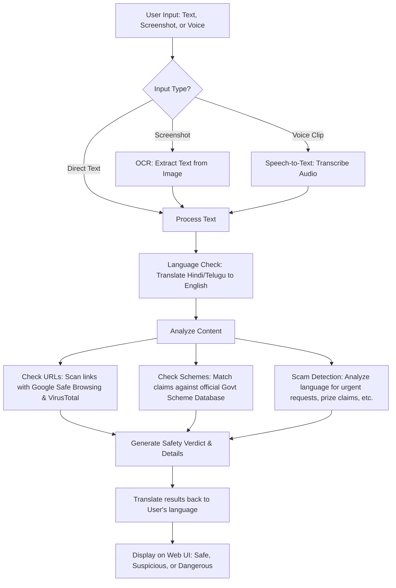

# Satark Setu: How It Works

**Satark Setu** is an intelligent safety assistant designed to detect scams, fake news, and fraudulent government scheme claims from text, screenshots (images), and voice clips.

Here is a simple explanation of how the system processes information and generates a safety verdict.

---

## 1. High-Level Workflow Diagram

---

## 2. Step-by-Step Breakdown

### Step 1: Input Reception
The user uploads or types their input on the Web UI (running at `http://localhost:8000`). The input can be:
*   **Direct Text**: An SMS message or copy-pasted text.
*   **An Image**: A screenshot of a text message, email, or digital poster.
*   **A Voice Clip**: A recorded voice call or audio note.

### Step 2: Extraction (For Images & Voice)
If the input isn't plain text, the system converts it first:
*   **Tesseract OCR** reads the text out of the image screenshot.
*   **Whisper AI** transcribes the spoken words from the voice clip.

### Step 3: Translation (For Multi-language Support)
Since the fraud detection patterns work best in English:
*   If the text is in **Hindi** or **Telugu**, the system uses preloaded **translation models** to translate it to English for analysis.

### Step 4: Triple-Check Security Analysis
Once the text is ready, the backend runs three distinct checks:
1.  **Scam Classifier Check**: Searches the text for suspicious behavior patterns (e.g., sense of urgency, asking for money transfer, lottery claims).
2.  **Official Scheme Verification**: If the message mentions a government scheme (like PM-KISAN), the system checks if the eligibility, required documents, and official links match the authentic government records in our database.
3.  **Link/URL Threat Scan**: Extracts any links in the text and scans them using:
    *   **Google Safe Browsing API** (checks if the URL is flagged for malware/phishing).
    *   **VirusTotal API** (checks the link against dozens of security databases).

### Step 5: Final Verdict Generation
The system translates the analysis details back to the user's preferred language (English, Hindi, or Telugu) and displays:
*   🟢 **Safe**: No scam indicators, legitimate links, correct scheme details.
*   🟡 **Suspicious**: Mismatched scheme details, or language that resembles common scam patterns.
*   🔴 **Dangerous**: Contains a confirmed dangerous link (phishing/malware), or highly fraudulent text.
